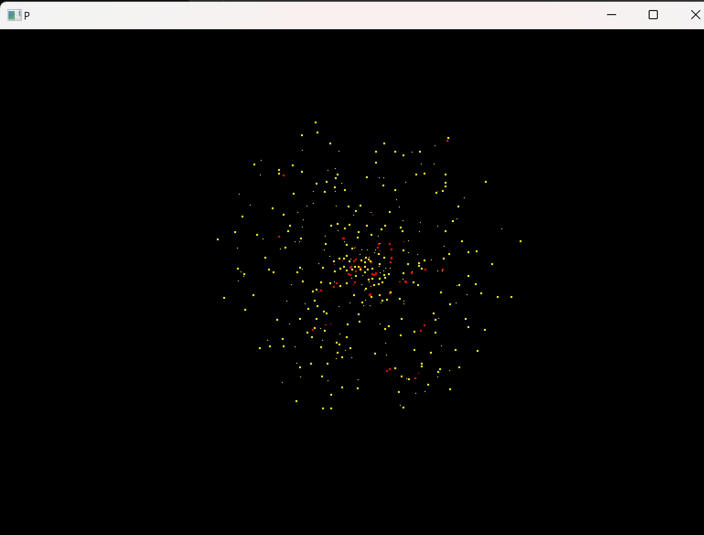

# 粒子爆炸模拟

这个项目模拟了粒子爆炸的效果,用于演示CPU和CUDA的性能差异。

## 演示效果

以下是程序运行时的效果图:



在这个演示中,您可以看到:

- 大量黄色粒子在屏幕上移动
- 粒子之间发生碰撞时会短暂变为红色
- 粒子会在屏幕边界反弹

这个演示直观地展示了粒子运动和碰撞的模拟效果,以及CPU和CUDA版本在处理大量粒子时的性能差异。


## 编译方法

1. 安装 Visual Studio 2022 生成工具
2. 安装 CUDA Toolkit 12.5
3. 在生成工具环境下执行以下命令:
   ```
   build.bat
   ```
   执行成功后会生成两个exe文件,分别对应CPU版本和CUDA版本

## 运行说明

- CPU版本: 运行 `cpu_demo.exe`
- CUDA版本: 运行 `cuda_demo.exe`

## 操作说明

- 按空格键: 重新初始化粒子

## 其他说明

- 粒子数量在 `particles.h` 中定义
- 可以通过修改 `particles.h` 中的 `ROWS` 和 `COLS` 来调整粒子数量

## 系统要求

- Windows操作系统
- 支持CUDA的NVIDIA显卡（仅CUDA版本需要）

## 注意事项

确保您的系统满足上述要求,特别是在运行CUDA版本时,需要有兼容的NVIDIA显卡。
